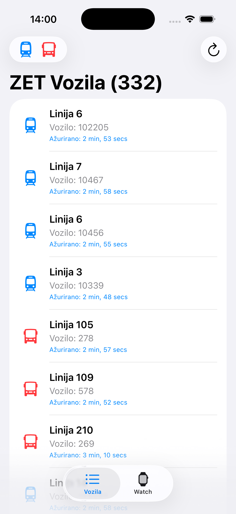
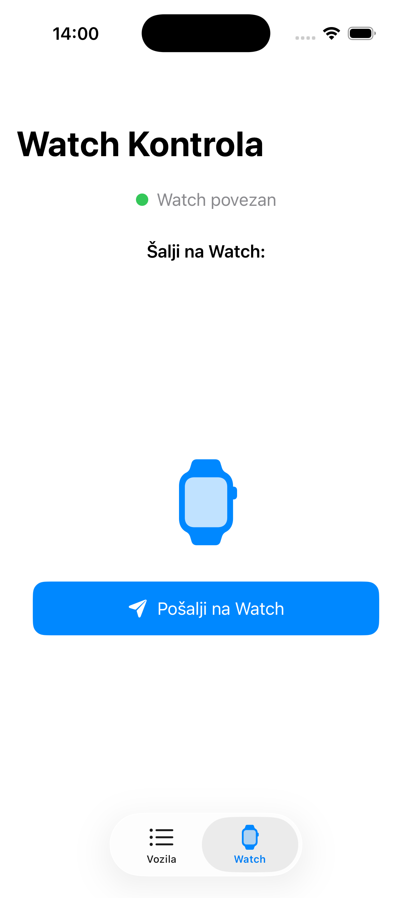
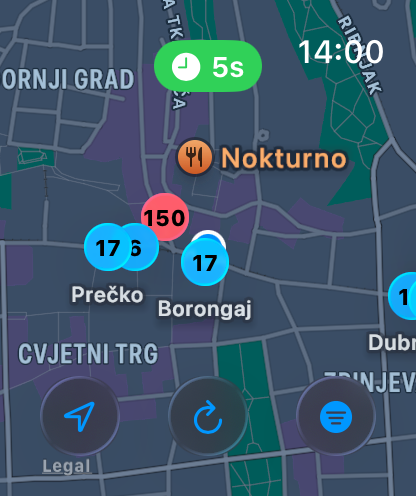
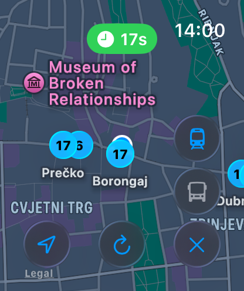

# ZET-tracker 

Real-time tracking of ZET vehicles on iPhone and Apple Watch.

## Features

- Real-time vehicle positions
- Map view with position updates
- iOS companion app
- WatchConnectivity sync

## Tech Stack

- Swift
- SwiftUI
- MapKit
- WatchConnectivity
- GTFS Realtime

## Screenshots

### iOS Vehicles View

  

### iOS Watch Control

  

### Apple Watch trams + buses

  

### Apple Watch trams only

  

## Data Source

ZET GTFS Realtime feed - https://www.zet.hr/preuzimanja/odredbe/datoteke-u-gtfs-formatu/669

## Author

Alen Jurina
